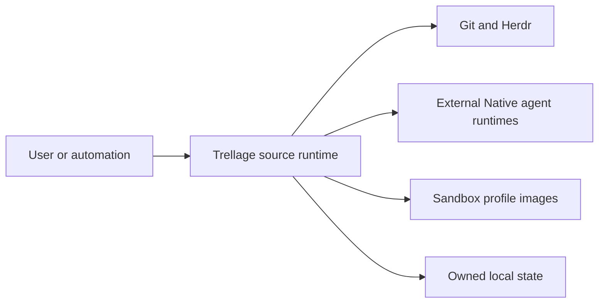
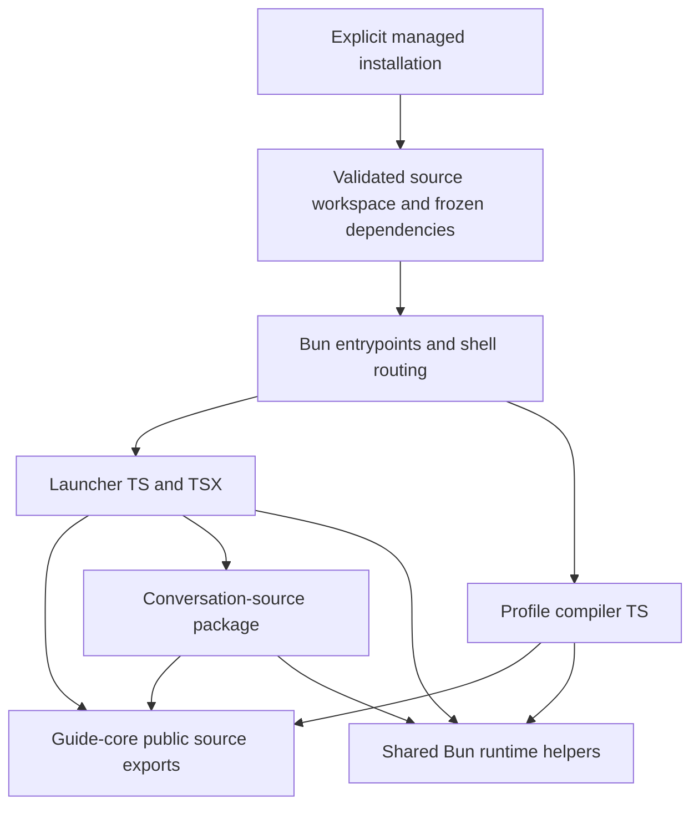

# ADR 0005: Run first-party TypeScript source through Bun

## Status

Accepted.

## Context

The launcher previously ran a tracked JavaScript bundle. Guide-core emitted
JavaScript and declarations, and the profile compiler built before execution.
The JCode configuration helper also had separate authored and bundled copies.
Changes could leave these copies out of sync. Tests that built their own
bundles did not prove that an installed source runtime would work.

Trellage needs one source graph for development, tests, and installation.
TypeScript and TSX must run without an application build or generated-code
commit. This does not remove dependency installation, runtime transpilation,
native dependencies, or Trellage's intended profile and container outputs.

## Alternatives considered

| Option | Benefits | Costs |
| --- | --- | --- |
| Keep Node and tracked bundles | Existing installation layout; fewer installed files | Two copies of application code; build freshness and generated-diff checks |
| Node with `tsx` | Retains Node compatibility; runs TSX source | Another execution loader; still needs source packaging and asset handling |
| Bun source workspaces | One TS/TSX source graph; package management and source execution use Bun | Requires Bun runtime and native-module compatibility checks; installation must validate workspace links |

## Decision

Use a pinned Bun runtime, one locked source workspace, and strict no-emit type
checks. Run first-party application, library, and JavaScript-family helper
source directly. Do not build an application bundle during install, tests,
or launch. Do not silently install a missing dependency during normal launch.

Use explicit `.ts` and `.tsx` relative imports within each package. Use named
public source exports between packages; do not import another package's private
files or `dist` directory. Bare third-party imports and `node:` built-ins are
valid. A built-in module name is not a request to start a Node process.

Keep CLI entrypoints thin. Importing a library must not start a CLI or install
anything. Load raw prompts and policy assets relative to their owning module,
not the caller's working directory or a Markdown loader's default behavior.

Promote production conversation capture out of the PoC. Keep shared
conversation contracts in guide-core and runtime-selection helpers in the
runtime package. Shared packages must not depend on application entrypoints.

Owned child processes select Bun explicitly, with dependency auto-installation
and environment-file loading disabled and an absolute managed configuration.
They preserve the intended working directory, arguments, signals, and exit
status. Third-party CLIs and SDK subprocesses retain their supported runtimes;
this decision does not claim that the external agent ecosystem is Node-free.

Bun can execute the caller's `bunfig.toml` preloads before the entrypoint.
Disabling environment-file loading alone does not prevent that. Apply an
explicit configuration at the first process boundary, not after TypeScript
code has started. A minimal Unix bootstrap can use `/dev/null` as an empty
configuration before it selects the managed workspace configuration.
Pass that option as one argument, `--config=/absolute/path`. Bun 1.3.3 can
accept a split `--config PATH` without executing the intended entrypoint.
Set `BUN_RUNTIME_TRANSPILER_CACHE_PATH=0` at process boundaries, including
children that replace their environment, to avoid emitted runtime cache files.

Installation stages sources and frozen dependencies before activation. It
validates ownership, source contents, assets, and permitted dependency links.
It must reject unexpected or escaping links, preserve an existing good runtime
on failure, and support source distribution without relying on unpublished
workspace dependencies being independently available from a registry.

The supported workspace setup command is
`scripts/install-source-runtime.sh --prepare`, not a raw Bun install. It owns
dependency preparation and the readiness receipt. Bun 1.3.3 can make workspace
bin source files group/world-writable during installation. Preparation must
correct only validated, owned, declared bin targets; it must not weaken general
ownership, symlink, or shared-write refusal.

For distribution, run `bun run package:source /absolute/path/trellage.tgz`.
The archive contains authored sources, canonical `.agents` assets, the lock,
and the original workspace manifest as `package.source.json`. Its publication
manifest has no private workspace dependencies. Do not publish a raw workspace
pack: publish this source archive instead. The install lifecycle prepares a
private `.trellage-runtime`; normal launches never install dependencies.
If the package manager blocks lifecycle scripts, explicitly run
`bash scripts/install-source-runtime.sh --package` from the installed package.
Packaging requires the host `tar` utility and refuses to overwrite an archive.

Preparation reads the host HTTPS npm registry configuration. It temporarily
fills empty lock transport URLs, without changing versions or integrity values,
then restores the exact canonical lock bytes before publishing readiness.
An exclusive `.trellage-install-lock` prevents concurrent preparation. Writes
are flushed before cleanup. If the lock inode changes during installation,
preparation fails and retains the canonical backup in that directory; inspect
the changed lock and restore the backup before removing the guard and retrying.
Do not commit host registry transport URLs.

Default Bun and npm download caches stay in temporary owned workspace
directories and are removed on success or failure. This keeps failed
installation from creating cache directories in a fresh home. Explicit user
cache settings remain supported.

Tests execute source, including PTY fixtures. A test runner launched by Bun
must also execute its workers under Bun; a Node shebang or child executable
must not make the check pass under the wrong runtime.

## Consequences

The source tree is the executable application. Contributors no longer rebuild
or review generated application bundles. No-emit checks remain mandatory:
Bun's runtime transpilation does not type-check code.

The installed runtime has more files and dependency links than a bundle.
Ownership and rollback checks must cover that structure. Missing source,
assets, dependencies, or the required Bun runtime are explicit errors, not
reasons to fall back to an old bundle or build on first use.

Compatibility must be checked at the actual boundaries: module exports, raw
assets, process transport, terminal input, native modules, installation, and
container helpers. Help output and successful imports alone do not establish
live SDK or agent compatibility. Offline fixtures must not consume model quota.

Independent experiments and reports remain outside the production workspace
unless they are explicitly adopted. Generated profile locks, images, runtime
receipts, and dependency binaries remain valid product or installation outputs.
